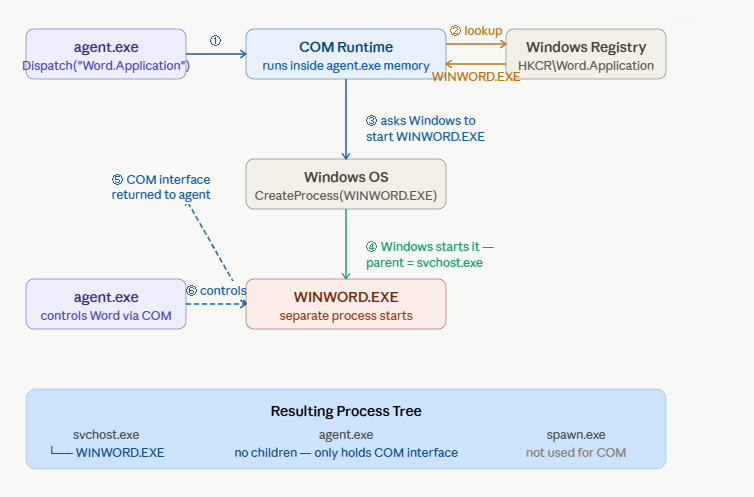
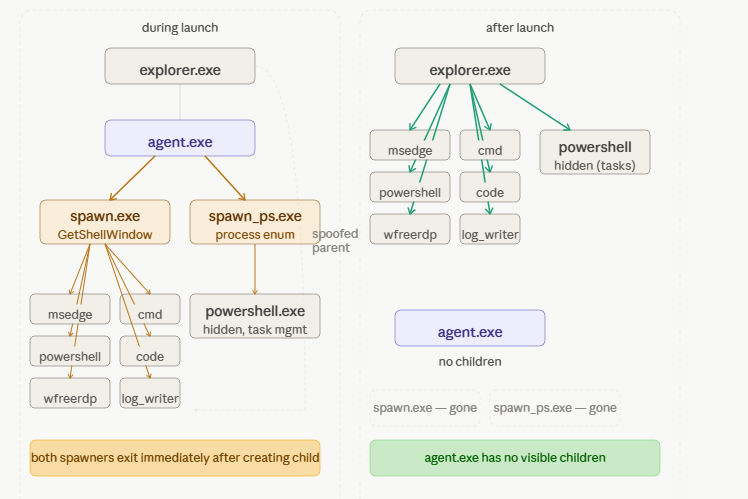
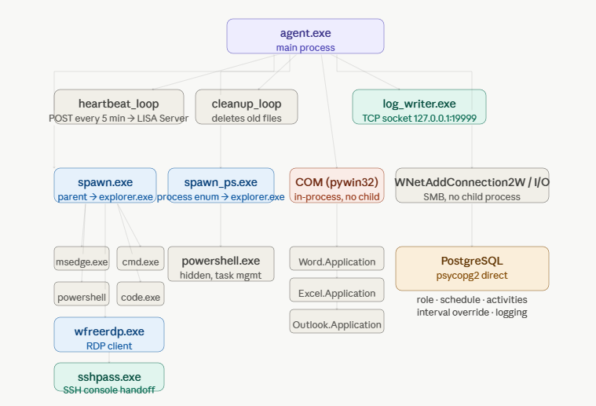

# LISA Windows Agent — Technical Documentation

## Table of Contents

1. [Overview](#1-overview)
2. [Architecture](#2-architecture)
3. [Technologies and Libraries](#3-technologies-and-libraries)
4. [Actions and Capabilities](#4-actions-and-capabilities)
   - [4.1 Web Browser](#41-web-browser)
   - [4.2 Terminal and PowerShell](#42-terminal-and-powershell)
   - [4.3 Microsoft Office Automation](#43-microsoft-office-automation)
   - [4.4 SMB Network Share Access](#44-smb-network-share-access)
   - [4.5 RDP Connections](#45-rdp-connections)
   - [4.6 Windows Registry](#46-windows-registry)
   - [4.7 Scheduled Task Management](#47-scheduled-task-management)
   - [4.8 VS Code](#48-vs-code)
   - [4.9 File Operations](#49-file-operations)
5. [Process Spoofing — spawn.exe and spawn_ps.exe](#5-process-spoofing--spawnexe-and-spawn_psexe)
6. [Parent Process Hiding Strategy](#6-parent-process-hiding-strategy)
7. [Log Writer](#7-log-writer)
8. [Database Connection](#8-database-connection)
9. [Server Communication and Heartbeat](#9-server-communication-and-heartbeat)
10. [Role System and Activity Scheduling](#10-role-system-and-activity-scheduling)
11. [Work Hours, Breaks, and Holidays](#11-work-hours-breaks-and-holidays)
12. [Singleton and Lock File](#12-singleton-and-lock-file)
13. [File Cleanup](#13-file-cleanup)
14. [Environment Configuration](#14-environment-configuration)
15. [Auto-Start Configuration](#15-auto-start-configuration)
16. [Compiling the Spoofers](#16-compiling-the-spoofers)
17. [Agent Compilation](#17-agent-compilation)
18. [Known Limitations](#18-known-limitations)

---

## 1. Overview

The LISA Windows Agent is a Python-based user behaviour simulation agent compiled into a standalone Windows executable using PyInstaller. It runs on Windows 10/11 machines and simulates realistic user activity — browsing the web, sending emails, editing documents, accessing file shares, and more.


The agent connects directly to a PostgreSQL database on the LISA Server to receive its role configuration, log activities, and send periodic heartbeats. All activity is driven by configurable role profiles stored in YAML files or in the database via the LISA frontend.

---

## 2. Architecture

### COM Automation — Office Applications

When the agent launches Word, Excel, or Outlook, it uses the Windows COM runtime — no spawn.exe is involved. The COM runtime looks up the executable in the registry, asks Windows OS to create the process, and returns a COM interface pointer to agent.exe. The Office application appears under `svchost.exe` in the process tree, not under `agent.exe`.



---

### Process Spoofing — spawn.exe and spawn_ps.exe

For all visible processes (browser, terminal, VS Code, wfreerdp), agent.exe calls spawn.exe which uses `PROC_THREAD_ATTRIBUTE_PARENT_PROCESS` to create the child with `explorer.exe` as the spoofed parent, then exits immediately. For hidden PowerShell (scheduled tasks), spawn_ps.exe does the same using process enumeration instead of `GetShellWindow`. After launch, agent.exe has no visible children.



---

### Full Agent Architecture

The diagram below shows all components and how agent.exe connects to them — threads, spawners, COM objects, database, and the SSH console handoff for RDP.



---

**Key design principle:** The agent itself (agent.exe) never appears as the parent of any visible user-facing process. All child processes are launched through spawn.exe or spawn_ps.exe which spoof the parent to explorer.exe using the Windows `PROC_THREAD_ATTRIBUTE_PARENT_PROCESS` API.

---


## 3. Technologies and Libraries

| Technology | Purpose |
|---|---|
| Python 3.11 | Agent runtime language |
| PyInstaller 6.x | Compiles agent.py into a standalone .exe |
| psycopg2-binary | Direct PostgreSQL connection for activity logging and role loading |
| requests | HTTP communication with the LISA Server API |
| python-dotenv | Loads configuration from the .env file |
| pyyaml | Reads YAML role definition files |
| pywin32 (win32com) | Windows COM automation — Word, Excel, Outlook, registry |
| psutil | In-process check for running processes — replaces tasklist subprocess call |
| C (GCC/MinGW) | spawn.exe and spawn_ps.exe compiled from C source |
| Windows Task Scheduler | Scheduled task simulation via PowerShell |
| Windows `WNetAddConnection2W` | SMB share mapping and access (in-process, no subprocess) |
| wfreerdp | FreeRDP client for RDP simulation |
| Windows Registry API | Registry read/write simulation via pywin32 |

---

## 4. Actions and Capabilities

### 4.1 Web Browser

**File:** `actions/apps.py`

Opens URLs in Microsoft Edge using spawn.exe so Edge appears under explorer.exe in the process tree. The agent picks randomly from a configured list of URLs and opens the browser for a randomised duration (15–25 seconds) before closing it.

The browser is launched via:
```python
subprocess.Popen([SPAWNER_PATH, EDGE_PATH, url], ...)
```

Edge and all its child processes (msedge.exe, msedgewebview2.exe) appear under explorer.exe, not agent.exe.

---

### 4.2 Terminal and PowerShell

**File:** `actions/terminal.py`

Runs CMD and PowerShell commands in visible windows via spawn.exe. Opens a CMD or PowerShell window with spawn.exe (parent appears as explorer.exe), keeps it open for 15–25 seconds, then kills it via `kill_process()` which routes through spawn.exe so taskkill.exe appears under explorer.exe, not agent.exe.

---

### 4.3 Microsoft Office Automation

**File:** `actions/office.py`, `actions/templates/`

Uses Windows COM automation via `pywin32` to control Office applications directly. All COM calls run in a dedicated STA thread to prevent COM deadlocks.

**Word (`word_document`)** — creates a `.docx` file in the Documents folder with configurable content. Uses `win32com.client.Dispatch("Word.Application")`. The document is saved and Word is closed after a delay.

**Excel (`excel_spreadsheet`)** — creates an `.xlsx` file with randomised data spread across multiple sheets. Uses `win32com.client.Dispatch("Excel.Application")`.

**Outlook — Send (`outlook_email`)** — sends an email to a configured recipient or a randomly chosen address from a list. Supports attachments — randomly picks files from the `dist/attachments/` folder. Uses `win32com.client.Dispatch("Outlook.Application")`. Has a 600-second timeout; if COM hangs, Outlook is force-killed via `kill_process("OUTLOOK.EXE")` which routes through spawn.exe.

**Outlook — Read (`outlook_read`)** — opens the inbox, reads unread emails, optionally opens attachments, and sends a reply. Same timeout and kill mechanism as send.

Templates for email subject/body and Word/Excel content are stored in `actions/templates/email.py` and `actions/templates/word_excel.py`.

---

### 4.4 SMB Network Share Access

**File:** `actions/smb.py`

Simulates a user accessing a Windows network file share. Maps a drive letter (Z:) using the Win32 `WNetAddConnection2W` API, performs file operations, then unmaps it via `WNetCancelConnection2W`.

**Browse mode** (default) performs all operations in sequence:
- Lists all files and folders on the share
- Reads all text files and logs their content (up to 200 characters)
- Edits an existing file by appending a timestamped note (resets the file if it exceeds 2KB)
- Creates a new timestamped file then deletes it
- Copies an existing file then deletes the copy

Drive mapping and unmapping are done entirely in-process via the Win32 API — no `net use` subprocess is spawned, so agent.exe never appears as a parent process for SMB operations. All file I/O after mapping uses standard Python (`os.listdir`, `open`, `shutil`) through the mapped drive letter.

---

### 4.5 RDP Connections

**File:** `actions/rdp.py`

Connects to a target Windows machine using `wfreerdp.exe` (FreeRDP). The connection is launched via **spawn.exe** so wfreerdp.exe appears under explorer.exe in the process tree, not under agent.exe. A randomised session duration is held, then the session is cleanly closed via SSH before wfreerdp.exe is killed.

The connection is built as a single argument string:
```
/v:{target} /u:{username} /p:{password} /cert:ignore /log-level:ERROR
```

`/cert:ignore` bypasses all certificate and identity dialogs on any Windows version. Multiple targets can be configured per role, each with its own username and password.

#### Console Session Handoff via SSH

When an RDP client connects to a Windows 10/11 machine, Windows disconnects the local console session — the physical monitor goes to the lock screen. To prevent this, the agent performs a **console session handoff** when closing the RDP connection:

1. **SSH query** — `sshpass.exe` connects to the target via SSH and runs `query user` to get the active session ID dynamically.
2. **tscon handoff** — runs `tscon {session_id} /dest:console` on the target via SSH, which transfers the session back to the physical console before the RDP link is dropped.
3. **Kill wfreerdp** — only after the handoff completes, wfreerdp.exe is terminated via `kill_process()` which routes through spawn.exe so taskkill.exe appears under explorer.exe.

This ensures the target machine's physical screen returns to the active desktop — not the lock screen — after every RDP session.

**Required binaries** (all must be in the windows-agent root alongside agent.py):
- `spawn.exe` — parent process spoofer
- `wfreerdp.exe` — FreeRDP client
- `sshpass.exe` — non-interactive SSH password authentication

`sshpass.exe` must be unblocked after download (Windows SmartScreen marks downloaded binaries):
```powershell
Unblock-File -Path "$env:USERPROFILE\windows-agent\sshpass.exe"
```

OpenSSH Server must be installed and running on the **target** machine for the handoff to work. The `install.ps1` script handles this automatically.

The SSH commands use `-q -o StrictHostKeyChecking=no -o UserKnownHostsFile=NUL` to suppress all interactive prompts and prevent hangs in headless operation.

---

### 4.6 Windows Registry

**File:** `actions/registry.py`

Reads and writes Windows registry keys using `pywin32`.

- **Read** — opens a specified registry path and reads a named value, logging the result.
- **Write** — writes a string value (e.g. a timestamp) to a specified registry path under `HKCU`.

---

### 4.7 Scheduled Task Management

**File:** `actions/tasks.py`

Creates, manages, and triggers Windows Scheduled Tasks. All PowerShell calls for task management are routed through spawn_ps.exe so the PowerShell process appears under explorer.exe.

**Task existence check** — uses spawn_ps.exe to run `Get-ScheduledTask` and writes the result to a temp file in `%TEMP%`, which Python reads back.

**Task creation** — builds a PowerShell script using `New-ScheduledTaskAction`, `New-ScheduledTaskTrigger`, `New-ScheduledTaskPrincipal`, and `Register-ScheduledTask -Force`. Supported triggers: Daily, Weekly, AtLogon, AtStartup.

**Task operations** — enable, disable, delete, and run operations are also routed through spawn_ps.exe.

**Frontend integration** — tasks are configured through the LISA frontend role builder, stored in the database as JSON, and loaded by the agent at runtime.

> **Note:** Tasks requiring `-RunLevel Highest` cannot be registered by a non-elevated session. The agent runs non-elevated by design.

---

### 4.8 VS Code

**File:** `actions/apps.py`

Opens VS Code with a randomly selected code snippet from a built-in list. The snippet is written to a temp file, VS Code is opened with that file, held open for a randomised period, then closed.

Launched via spawn.exe — VS Code appears under explorer.exe in the process tree.

---

### 4.9 File Operations

**File:** `agent.py`

Creates a text file at a configurable path (supports `%USERPROFILE%` expansion) with configurable content. Used to simulate document creation activity without requiring Office to be installed.

---

## 5. Process Spoofing — spawn.exe and spawn_ps.exe

Both binaries are written in C and compiled with MinGW (`x86_64-w64-mingw32-gcc`). They use the Windows `PROC_THREAD_ATTRIBUTE_PARENT_PROCESS` API to launch a child process with a spoofed parent — making it appear as a child of explorer.exe rather than agent.exe.

**spawn.exe** — general purpose. Uses `GetShellWindow()` to find the shell window and obtain the explorer.exe PID. Launches the target with `CREATE_NEW_CONSOLE`. Used for browsers, terminal windows, VS Code, and log_writer.exe.

**spawn_ps.exe** — designed for hidden PowerShell execution. Finds explorer.exe by enumerating all running processes by name using `CreateToolhelp32Snapshot` (more reliable than `GetShellWindow()` in non-interactive sessions). Launches the target with `CREATE_NO_WINDOW` and `SW_HIDE` to prevent any window from appearing. Used exclusively by tasks.py.

**Source files:**
- `spoofer/spawn.c`
- `spoofer/spawn_ps.c`

---

## 6. Parent Process Hiding Strategy verified using Sysmon and PS

The agent uses a layered strategy to ensure it never appears as the parent of any visible process:

| Process | Launch method | Parent in task list |
|---|---|---|
| Edge (browser) | spawn.exe | explorer.exe |
| CMD window | spawn.exe | explorer.exe |
| PowerShell window | spawn.exe | explorer.exe |
| VS Code | spawn.exe | explorer.exe |
| log_writer.exe | spawn.exe | explorer.exe |
| PowerShell (task mgmt) | spawn_ps.exe | explorer.exe |
| SMB (Windows WNetAddConnection2W) | direct (no process) | N/A |
| wfreerdp.exe (RDP) | spawn.exe | explorer.exe |


---

## 7. Log Writer

**Files:** `utils/log_writer.py`, `log_writer.exe`

The log writer is a separate executable that acts as a TCP socket server listening on `localhost:19999`. It receives log records from the agent over a local TCP connection and writes them to `logs/agent.log`. This keeps the log file handle out of the agent process — it appears under explorer.exe (launched via spawn.exe) instead of agent.exe.

The agent uses a custom logging handler (`utils/logger.py`) that uses `logging.handlers.SocketHandler` to send all log messages to `127.0.0.1:19999`, where log_writer.exe receives them as pickled `LogRecord` objects and writes them to `logs/agent.log`.

A mutex (`LISA_LogWriter_Mutex`) prevents multiple instances of log_writer.exe from running simultaneously.

---

## 8. Database Connection

**File:** `client/database.py`

The agent connects directly to the LISA Server PostgreSQL database using psycopg2. All credentials are loaded from the `.env` file via python-dotenv.

Key database operations:
- `ensure_agent_exists` — registers the agent on first run
- `get_agent_role` — retrieves the current role assignment
- `get_role_definition` — loads the full role activity config (for custom roles)
- `log_activity` — records each completed action with type, details, and timestamp
- `update_agent_status` — updates the agent's last-seen status
- `get_agent_schedule` — retrieves assigned work hours
- `get_agent_break` — retrieves assigned break times
- `is_public_holiday` — checks if today is a configured holiday
- `get_deleted_tasks` / `mark_task_deleted` / `restore_task` — manages the scheduled task deletion state
- `get_agent_interval` — retrieves the per-agent activity interval override (`interval_min`, `interval_max`) from the database, or `None` if not set
- `set_agent_interval` — sets the activity interval override for this agent in the database

---

## 9. Server Communication and Heartbeat

**File:** `client/server_api.py`

The agent sends an HTTP POST to `http://{SERVER_IP}:{SERVER_PORT}/api/agents/heartbeat` every 300 seconds. The heartbeat payload includes the agent ID, username, role, `os_type`, `system_info`, `last_activity`, and `current_activity`.

There is no separate activity logging endpoint — activities are logged through the heartbeat itself via the `current_activity` field. The backend reads this field and saves it to `agent.last_activity` and as an `AgentActivity` record.

The heartbeat thread also checks for role changes in the database. If the role has been updated in the frontend, the agent reloads its activity list without restarting.

---

## 10. Role System and Activity Scheduling

**Files:** `roles/`, `agent.py`

Roles define the set of activities the agent performs and their relative weights. Two role sources are supported:

**YAML roles** — stored in `roles/user.yaml`, `roles/admin.yaml`, `roles/dev.yaml`. Loaded from disk at startup.

**Custom roles** — created through the LISA frontend role builder and stored in the `agent_role_definitions` table in PostgreSQL. Loaded via `db.get_role_definition()`. The database role overrides the YAML role if one is assigned.

Activities are selected using weighted random choice — an activity with weight 3 is chosen three times as often as one with weight 1. Between activities, the agent waits a randomised interval. The default interval is configured via `activity_interval_min` and `activity_interval_max` in `config/settings.yaml`. This can be overridden per agent from the LISA frontend (Agent detail page → Activity Interval), which stores the values in the database and takes precedence over the local settings.

---

## 11. Work Hours, Breaks, and Holidays

**File:** `agent.py` — `is_work_time()` and `_check_break()`

The agent only performs activities during configured working hours. Three levels of scheduling are checked in order:

1. **Public holidays** — if today is a holiday in the `public_holidays` table, the agent is idle all day.
2. **Agent-specific schedule** — from the `agent_schedules` table, assigned via the frontend. Supports overnight shifts.
3. **Local schedule** — fallback from `config/settings.yaml` (`work_start`, `work_end`, `work_days`).

Break times are checked within working hours. If the current time falls within an assigned break window, the agent is idle until the break ends.

---

## 12. Singleton and Lock File

**File:** `agent.py` — `check_singleton()`

The agent creates a lock file (`{agent_id}.lock`) on startup to prevent multiple instances running simultaneously. On the next startup, if the lock file exists, it is deleted and a new one is created — treating it as a stale lock from a previous session (e.g. after a reboot or crash).

---

## 13. File Cleanup

**File:** `actions/cleanup.py`

A background thread runs every 24 hours and deletes files in the agent's working directory that are older than 4 days. This prevents accumulation of temp files (Word documents, Excel files, etc.) created during simulation.

---

## 14. Environment Configuration

**File:** `.env`

All sensitive configuration is stored in the `.env` file and loaded at startup via python-dotenv. No credentials are hardcoded in the source.

```
SERVER_IP=your_server_ip
SERVER_PORT=8000
DB_HOST=your_server_ip
DB_PORT=5432
DB_NAME=your_db_name
DB_USER=your_db_user
DB_PASSWORD=your_db_password
```

The `.env` file must be placed in the `windows-agent` root directory — one level above `dist/` where `agent.exe` lives. When frozen, PyInstaller sets `sys.executable` to `dist/agent.exe`, so the agent resolves `.env` at `os.path.dirname(os.path.dirname(sys.executable))` which is the `windows-agent` root.

---

## 15. Auto-Start Configuration

**File:** `setup_autostart.ps1`

A PowerShell script that registers the agent as a Windows Scheduled Task with an `AtLogon` trigger. The task is configured to:

- Start automatically when the configured user logs in
- Restart up to 3 times with a 1-minute interval if it crashes
- Run with no execution time limit
- Allow start if on battery and not stop if going on battery

The script uses `$env:USERNAME` and `$env:USERDOMAIN` dynamically so it works on any Windows machine without modification.

**Auto-login** is configured via the Windows registry (`Winlogon` keys) to allow the machine to log in automatically on reboot, enabling the agent to start without any manual intervention.

---

## 16. Compiling the Spoofers

Both spoofer binaries are compiled from C source using MinGW. They can be cross-compiled on Linux or compiled natively on Windows.

### Cross-compiling on Linux (recommended)

```bash
# Install cross-compiler
sudo apt install -y mingw-w64

# Compile spawn.exe
x86_64-w64-mingw32-gcc -o spawn.exe spoofer/spawn.c -luser32 -static

# Compile spawn_ps.exe
x86_64-w64-mingw32-gcc -o spawn_ps.exe spoofer/spawn_ps.c -luser32 -static
```

### Compiling on Windows (requires MSYS2)

```bash
# In MSYS2 ucrt64 terminal
cd /c/Users/$USERNAME/windows-agent/spoofer

gcc -o spawn.exe spawn.c -luser32
gcc -o spawn_ps.exe spawn_ps.c -luser32
```

After compiling, place both executables in the windows-agent root directory (same level as `agent.py`):

```
windows-agent/
├── spawn.exe
├── spawn_ps.exe
├── log_writer.exe
├── agent.py
├── ...
```

### What spawn.exe does

1. Calls `GetShellWindow()` to get the explorer.exe PID
2. Opens a handle to explorer.exe with `PROCESS_CREATE_PROCESS`
3. Builds a `PROC_THREAD_ATTRIBUTE_LIST` with `PROC_THREAD_ATTRIBUTE_PARENT_PROCESS`
4. Calls `CreateProcessA` with `EXTENDED_STARTUPINFO_PRESENT` — the child process inherits explorer.exe as its parent
5. Waits for the child process to exit via `WaitForSingleObject`

### What spawn_ps.exe does

Same as spawn.exe except:
- Finds explorer.exe by enumerating all processes by name (`CreateToolhelp32Snapshot`) instead of `GetShellWindow()` — more reliable in non-interactive sessions
- Launches with `CREATE_NO_WINDOW` and `SW_HIDE` — no window appears at all
- Designed specifically for hidden PowerShell execution in the scheduled task module

---

## 17. Agent Compilation

Remove old build artifacts first:

```powershell
Remove-Item -Recurse -Force build, dist
```

Compile:

```powershell
pyinstaller --onefile --name agent `
  --hidden-import win32com.client `
  --hidden-import win32com.shell `
  --hidden-import pythoncom `
  --hidden-import psycopg2 `
  --hidden-import yaml `
  --hidden-import requests `
  --hidden-import psutil `
  --hidden-import win32gui `
  --hidden-import win32process `
  --hidden-import win32con `
  --hidden-import dotenv `
  agent.py
```

Copy the attachments folder into dist:

```powershell
xcopy /E /I attachments dist\attachments
```

The final executable is at `dist\agent.exe`. `spawn.exe`, `spawn_ps.exe`, `log_writer.exe`, `sshpass.exe`, `wfreerdp.exe`, and `.env` stay in the **windows-agent root** — one level above `dist/`. The agent resolves them from there at runtime.

---

## 18. Known Limitations

| Limitation | Detail |
|---|---|
| Scheduled tasks with `-RunLevel Highest` | Cannot be registered by a non-elevated session. The agent runs non-elevated by design. Tasks requiring admin privileges (e.g. clearing event logs) must be registered manually as Administrator. |
| Outlook COM dependency | Outlook must be installed and configured with a valid email account before `outlook_email` and `outlook_read` actions will work. |